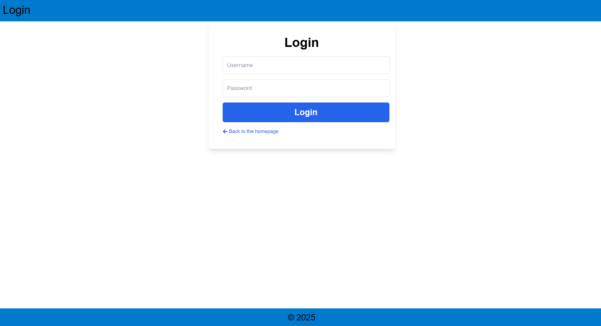
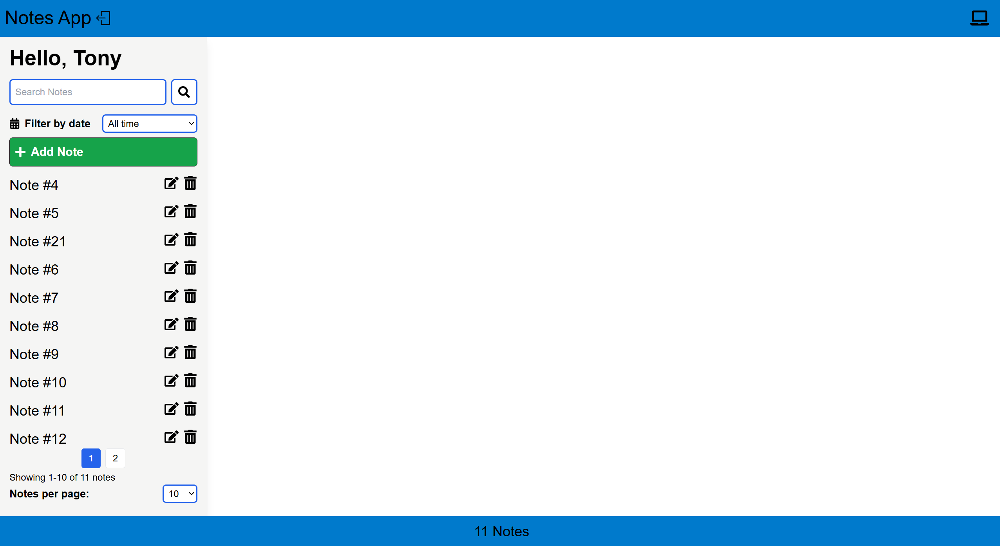

[🇩🇪 Deutsch](README.de.md)
[🇬🇧 English](README.md)

# 📝 Notizen-App

Eine Full-Stack-Notizen-App, entwickelt mit **Django**, **React**, **PostgreSQL** und **Docker**. Die App ermöglicht es Benutzer:innen, Notizen mit Rich-Text-Formatierung zu erstellen, zu verwalten und zu durchsuchen. Sie verwendet JWT-Authentifizierung und ist für die Cloud-Bereitstellung vorbereitet (AWS S3 & EC2).

---

## 🔗 Live-Demo

Demnächst verfügbar — Backend auf AWS EC2, Frontend auf Netlify

---

## ⚙️ Tech-Stack

**Frontend:** React, Tailwind CSS, Quill.js  
**Backend:** Django, Django REST Framework  
**Datenbank:** PostgreSQL  
**Authentifizierung:** JWT (SimpleJWT)  
**Deployment:** Docker, Docker Compose  
**Cloud-Ready:** AWS EC2 (Backend + Datenbank), Netlify (Frontend), AWS S3 (Medien)

---

## ✅ Funktionen

- 🔐 Benutzer-Authentifizierung (Registrierung / Login / Logout)
- 📝 Notizen erstellen, bearbeiten, löschen
- 🎨 Rich-Text-Editor (fett, kursiv, unterstrichen, Code, Links)
- 🖼️ Unterstützung für Bild-Uploads (AWS S3-kompatibel)
- 📅 Notizen nach Datum filtern
- 🔍 Volltextsuche (mit PostgreSQL)
- 📄 Paginierung (limit/offset)
- 🔄 Responsives Layout mit Tailwind CSS
- 📱 Mobile-First Design mit React Hooks & Bildschirmtyp-Erkennung
- ⚓ Datenpersistenz mit PostgreSQL
- 🐳 Containerisiert mit Docker

---

## 📸 Screenshots

> _Befinden sich im Ordner `assets/`_

  
  
  


---

### 🔧 Voraussetzungen
Das Projekt kann entweder mit Docker oder manuell (Frontend & Backend separat) gestartet werden.

**Option 1: Docker (empfohlen)**

- Docker
- Docker Compose

**Option 2: Manuelle Einrichtung**

*Backend:*
- Python 3.11+
- pip (Python Package Manager)
- PostgreSQL

*Frontend:*
- Node.js (v18+)
- npm oder yarn

---

## 🛠️ Erste Schritte

### 1. Repository klonen

```bash
git clone https://github.com/BohdanDzihim/notes.git
cd notes
```

2. Umgebungsvariablen einrichten
Es werden zwei .env-Dateien benötigt:
* Root .env (für Docker)
<details> 
<summary>📄 Klicken zum Anzeigen der Docker-Umgebung</summary>

```ini
# .env (im Projektstamm)
ENV_TYPE=docker

SECRET_KEY=your_local_django_secret_key

DB_NAME=mydb
DB_USER=myuser
DB_PASSWORD=mypassword
DB_HOST=db
DB_PORT=5432

POSTGRES_DB=mydb
POSTGRES_USER=myuser
POSTGRES_PASSWORD=mypassword

AWS_ACCESS_KEY_ID=your_aws_access_key_id
AWS_SECRET_ACCESS_KEY=your_aws_secret_access_key
AWS_STORAGE_BUCKET_NAME=your_aws_storage_bucket_name
AWS_S3_REGION_NAME=your_aws_s3_region_name
```
</details>

* Backend .env.local (für lokale Django-Entwicklung)
<details> 
<summary>📄 Klicken zum Anzeigen von .env.local</summary>

```ini
# myproject/myproject/.env.local
ENV_TYPE=local

SECRET_KEY=your_local_django_secret_key

DB_NAME=your_db_name
DB_USER=your_db_user
DB_PASSWORD=your_db_password
DB_HOST=127.0.0.1
DB_PORT=5432

AWS_ACCESS_KEY_ID=your_aws_access_key_id
AWS_SECRET_ACCESS_KEY=your_aws_secret_access_key
AWS_STORAGE_BUCKET_NAME=your_aws_storage_bucket_name
AWS_S3_REGION_NAME=your_aws_s3_region_name
```
</details>

### 3. Mit Docker starten

```bash
docker-compose up --build
```

* Backend: http://localhost:8000
* Frontend: http://localhost:3000 (bereitgestellt über Nginx)
* Datenbank: PostgreSQL (Container)

### 📂 Projektstruktur

```bash
notes/
├── assets/             # Screenshots
├── frontend/           # React-App (UI + Quill.js)
├── myproject/          # Django-Backend
│   ├── api/            # API-Logik
│   ├── myproject/      # Zentrale Django-Einstellungen
│   │   └── .env.local  # Lokale Dev-Umgebung (nicht im Git enthalten)
│   ├── notes/          # Notiz-Modell
│   ├── static/         # Admin-Static-Files
│   ├── users/          # Benutzer-Modell
│   ├── Dockerfile
│   ├── manage.py
│   ├── requirements.txt
│   └── wait-for-it.sh
├── .env         # Root-Umgebungsdatei (für Docker, nicht im Git)
├── .gitignore
├── docker-compose.yml
└── README.md
```

## 🌍 Konfiguration für Deployment
Stelle sicher, dass du diese Dateien aktualisierst, wenn du Frontend und Backend in verschiedenen Umgebungen deployen möchtest:

### 🛠 settings.py (Django)
```python
CORS_ALLOWED_ORIGINS = [
    'http://localhost:3000',
    'https://<dein-netlify-projekt>.netlify.app',  # Ersetze dies durch deine eigene Netlify-Domain
]

ALLOWED_HOSTS = [
    'deine-ec2-public-ip',  # z. B. "3.120.210.18"
    'localhost',
    '127.0.0.1'
]
```

### 🌐 Umgebungsvariablen für das Frontend
Bevor du das Frontend für die Produktion baust, erstelle eine .env-Datei im frontend/-Verzeichnis:

```bash
touch frontend/.env
```

Füge dann deine Backend-API-URL wie folgt ein:

```env
REACT_APP_API_URL=http://<deine-ec2-ip>:8000/api/
```

🧠 Hinweis: Diese Variable wird im Frontend-Code so verwendet:

```js
const API = process.env.REACT_APP_API_URL;
```
Du musst also keine .js-Dateien ändern — nur die .env-Datei anpassen.

### ⚙️ Frontend-Build erstellen
Nachdem du die .env angepasst hast, führe den Build aus:

```bash
cd frontend
npm run build
```
Dadurch wird ein build/-Ordner generiert, in dem die korrekte Backend-URL integriert ist.

## 🔐 NGINX & HTTPS Setup (Erforderlich)
Um CORS- oder Mixed-Content-Fehler zu vermeiden, wenn dein Frontend HTTPS verwendet:

### 1. NGINX konfigurieren
Beispielkonfiguration für den Block in `/etc/nginx/sites-available/default`:

```nginx
server {
    listen 80;
    server_name your-domain.duckdns.org;

    location / {
        return 301 https://$host$request_uri;
    }
}

server {
    listen 443 ssl;
    server_name your-domain.duckdns.org;

    ssl_certificate /etc/letsencrypt/live/your-domain.duckdns.org/fullchain.pem;
    ssl_certificate_key /etc/letsencrypt/live/your-domain.duckdns.org/privkey.pem;
    include /etc/letsencrypt/options-ssl-nginx.conf;
    ssl_dhparam /etc/letsencrypt/ssl-dhparams.pem;

    location /api/ {
        proxy_pass http://127.0.0.1:8000;
        proxy_set_header Host $host;
        proxy_set_header X-Real-IP $remote_addr;
        proxy_set_header X-Forwarded-For $proxy_add_x_forwarded_for;
        proxy_set_header X-Forwarded-Proto $scheme;
    }
}
```

### 2. SSL-Zertifikat mit Certbot erstellen

```bash
sudo apt install certbot python3-certbot-nginx
sudo certbot --nginx -d your-domain.duckdns.org
```

## 🚀 Deployment

* 🔙 Backend + 🐘 PostgreSQL Datenbank
Bereitgestellt mit Docker Compose auf einer AWS EC2 Instanz.
Django läuft hinter NGINX (HTTPS via Let's Encrypt) und verwendet JWT.

* 📦 Medien-Uploads
Bilder werden in einem sicheren AWS S3 Bucket gespeichert.

* 🌐 Frontend (React)
Wird mit npm run build gebaut und auf Netlify deployed.
Verwendet HTTPS & Umgebungsvariablen zur API-Kommunikation.

## 💡 Lizenz
MIT — Frei nutzbar und veränderbar