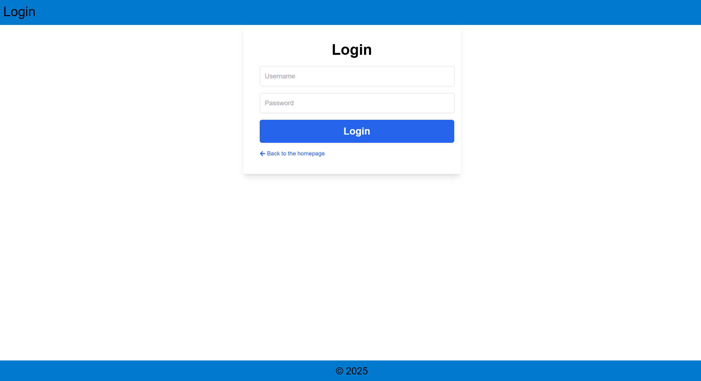
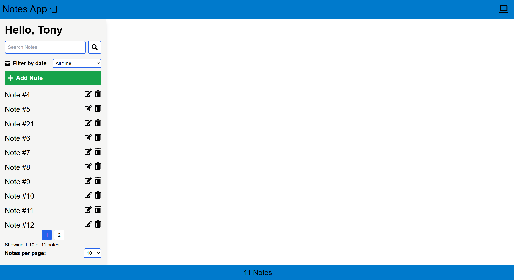
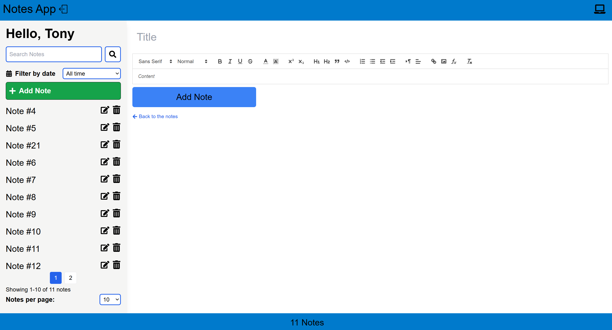
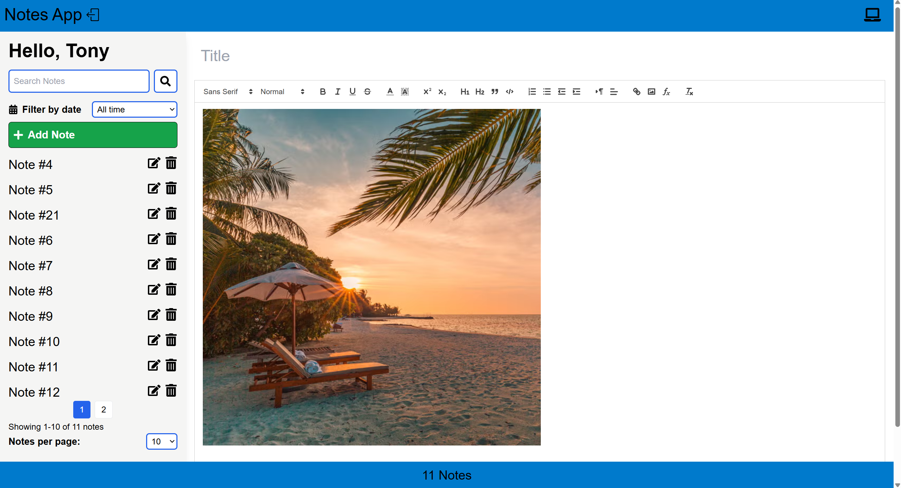

[🇬🇧 English](README.md)
[🇩🇪 Deutsch](README.de.md)

# 📝 Notes App

A full-stack Notes App built with **Django**, **React**, **PostgreSQL**, and **Docker**. The app allows users to create, manage, and search notes with rich-text formatting. It features JWT authentication and is prepared for cloud deployment (AWS S3 & EC2).

---

## 🔗 Live Demo

🌐 **Frontend:** [https://unrivaled-pothos-8ffba4.netlify.app](https://unrivaled-pothos-8ffba4.netlify.app)

🔙 **Backend:** Deployed on AWS EC2 with HTTPS & NGINX reverse proxy  

---

## ⚙️ Tech Stack

**Frontend:** React, Tailwind CSS, Quill.js  
**Backend:** Django, Django REST Framework  
**Database:** PostgreSQL  
**Auth:** JWT (SimpleJWT)  
**Deployment:** Docker, Docker Compose  
**Cloud Ready:** AWS EC2 (backend + db), Netlify (frontend), AWS S3 (media)

---

## ✅ Features

- 🔐 User authentication (Register/Login/Logout)
- 📝 Create, edit, delete notes
- 🎨 Rich text editor (bold, italic, underline, code, links)
- 🖼️ Image upload support (AWS S3-ready)
- 📅 Filter notes by date
- 🔍 Full-text search (with PostgreSQL)
- 📄 Pagination (limit/offset)
- 🔄 Fully responsive layout using Tailwind CSS
- 📱 Mobile-first design with React Hooks & screen-type icon detection
- ⚓ Data persistence with PostgreSQL
- 🐳 Containerized with Docker

---

## 📸 Screenshots

> _Located in `assets/` folder_






---

### 🔧 Prerequisites
You can run this project either using Docker or by setting up the frontend and backend manually.

**Option 1: Docker (Recommended)**

- Docker
- Docker Compose

**Option 2: Manual Setup**

*Backend:*
- Python 3.11+
- pip (Python package manager)
- PostgreSQL

*Frontend:*
- Node.js (v18+)
- npm or yarn

---

## 🛠️ Getting Started

### 1. Clone the repo

```bash
git clone https://github.com/BohdanDzihim/notes.git
cd notes
```

### 2. Setup Environment Variables
There are two .env required:
* Root .env (for Docker)
<details>
<summary>📄 Click to view .env for Docker</summary>

```ini
# .env (at project root)
ENV_TYPE=docker

SECRET_KEY=your_local_django_secret_key

DB_NAME=mydb
DB_USER=myuser
DB_PASSWORD=mypassword
DB_HOST=db
DB_PORT=5432

POSTGRES_DB=mydb
POSTGRES_USER=myuser
POSTGRES_PASSWORD=mypassword

AWS_ACCESS_KEY_ID=your_aws_access_key_id
AWS_SECRET_ACCESS_KEY=your_aws_secret_access_key
AWS_STORAGE_BUCKET_NAME=your_aws_storage_bucket_name
AWS_S3_REGION_NAME=your_aws_s3_region_name
```
</details>

* Backend .env.local (for Django)
<details>
<summary>📄 Click to view .env.local</summary>

```ini
# myproject/myproject/.env.local
ENV_TYPE=local

SECRET_KEY=your_local_django_secret_key

DB_NAME=your_db_name
DB_USER=your_db_user
DB_PASSWORD=your_db_password
DB_HOST=127.0.0.1
DB_PORT=5432

AWS_ACCESS_KEY_ID=your_aws_access_key_id
AWS_SECRET_ACCESS_KEY=your_aws_secret_access_key
AWS_STORAGE_BUCKET_NAME=your_aws_storage_bucket_name
AWS_S3_REGION_NAME=your_aws_s3_region_name
```
</details>

### 3. Run with Docker

```bash
docker-compose up --build
```

* Backend: http://localhost:8000
* Frontend: http://localhost:3000 (served by Nginx)
* DB: PostgreSQL (containerized)

### 📂 Project Structure

```bash
notes/
├── assets/             # Screenshots
├── frontend/           # React app (UI + Quill.js)
├── myproject/          # Django backend
│   ├── api/            # API logic
│   ├── myproject/      # Core Django settings
│   │   └── .env.local  # Local dev env (also NOT committed to Git)
│   ├── notes/          # Note model
│   ├── static/         # Admin static files
│   ├── users/          # Custom user model
│   ├── Dockerfile
│   ├── manage.py
│   ├── requirements.txt
│   └── wait-for-it.sh
├── .env         # Root env file (used by Docker, NOT committed to Git)
├── .gitignore
├── docker-compose.yml
└── README.md
```

## 🌍 Configuration for Deployment
Make sure to update these files when deploying the frontend and backend to different environments:

### 🛠 settings.py (Django)
```python
CORS_ALLOWED_ORIGINS = [
    'http://localhost:3000',
    'https://unrivaled-pothos-8ffba4.netlify.app',  # Replace with your actual frontend domain
]

ALLOWED_HOSTS = [
    'your-ec2-public-ip',  # e.g. "3.120.210.18"
    'localhost',
    '127.0.0.1'
]
```

### 🌐 Frontend Environment Setup
Before building the frontend for production, create a .env file inside the frontend/ directory:

```bash
touch frontend/.env
```

Then add your backend API URL like this:

```env
REACT_APP_API_URL=https://your-domain.duckdns.org/api/
```

🧠 Note: This value is used in the frontend code via:

```js
const API = process.env.REACT_APP_API_URL;
```
So there's no need to modify any JS files — just update the .env.

### ⚙️ Rebuild the Frontend
After setting the .env, run the production build:

```bash
cd frontend
npm run build
```
This will generate a build/ folder with the correct backend API URL baked in.

## 🔐 NGINX & HTTPS Setup (Required)
To avoid CORS or Mixed Content errors when your frontend uses HTTPS:

### 1. Configure NGINX
Example `/etc/nginx/sites-available/default` block:

```nginx
server {
    listen 80;
    server_name your-domain.duckdns.org;

    location / {
        return 301 https://$host$request_uri;
    }
}

server {
    listen 443 ssl;
    server_name your-domain.duckdns.org;

    ssl_certificate /etc/letsencrypt/live/your-domain.duckdns.org/fullchain.pem;
    ssl_certificate_key /etc/letsencrypt/live/your-domain.duckdns.org/privkey.pem;
    include /etc/letsencrypt/options-ssl-nginx.conf;
    ssl_dhparam /etc/letsencrypt/ssl-dhparams.pem;

    location /api/ {
        if ($request_method = OPTIONS) {
            # Replace with your actual frontend domain
            add_header 'Access-Control-Allow-Origin' 'https://unrivaled-pothos-8ffba4.netlify.app' always; 
            add_header 'Access-Control-Allow-Methods' 'GET, POST, PUT, PATCH, DELETE, OPTIONS' always;
            add_header 'Access-Control-Allow-Headers' 'Authorization, Content-Type' always;
            add_header 'Access-Control-Max-Age' 3600 always;
            return 204;
        }

        proxy_pass http://127.0.0.1:8000;
        proxy_set_header Host $host;
        proxy_set_header X-Real-IP $remote_addr;
        proxy_set_header X-Forwarded-For $proxy_add_x_forwarded_for;
        proxy_set_header X-Forwarded-Proto $scheme;
    }
}
```

### 2. Create an SSL Certificate with Certbot

```bash
sudo apt install certbot python3-certbot-nginx
sudo certbot --nginx -d your-domain.duckdns.org
```

## 🚀 Deployment

* 🔙 Backend + 🐘 PostgreSQL Database
Deployed together using Docker Compose on an AWS EC2 instance.
Django app is reverse-proxied via Nginx, secured with HTTPS (Let's Encrypt), and uses JWT authentication.

* 📦 Media Storage
All uploaded images are stored securely in an AWS S3 Bucket using django-storages.

* 🌐 Frontend (React)
Built with npm run build and deployed to Netlify.
Communicates with the backend API via HTTPS and uses environment variables (REACT_APP_API_URL) for endpoint configuration.

## 💡 License
MIT — Free to use and modify