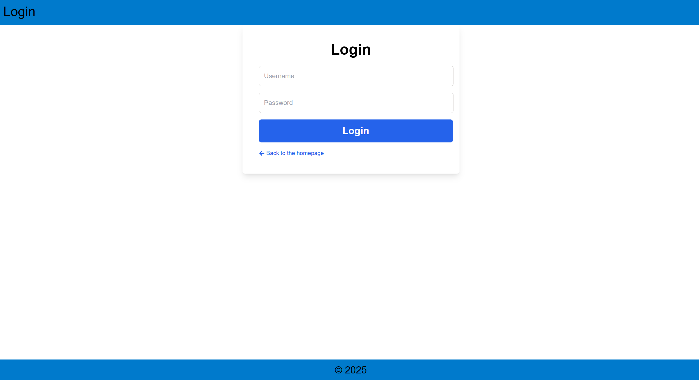
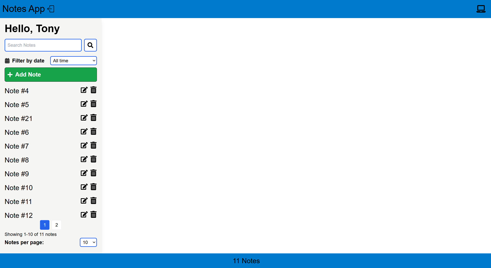
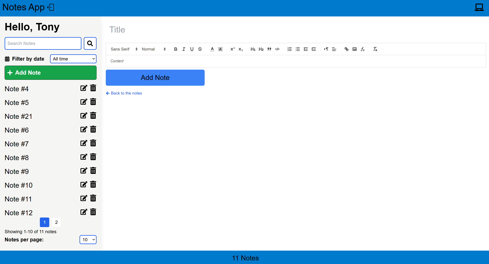
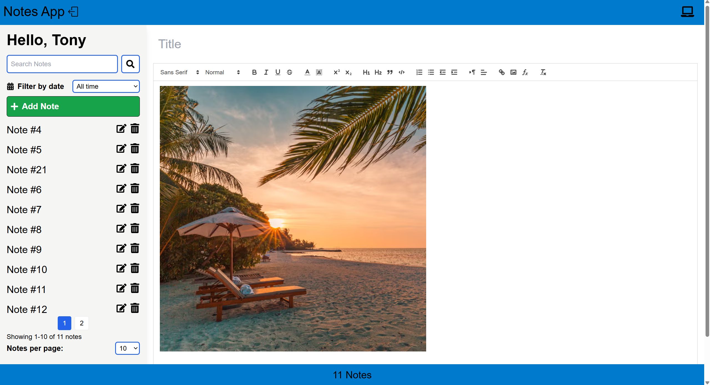

[🇬🇧 English](README.md)
[🇩🇪 Deutsch](README.de.md)

# 📝 Notes App

A full-stack Notes App built with **Django**, **React**, **PostgreSQL**, and **Docker**. The app allows users to create, manage, and search notes with rich-text formatting. It features JWT authentication and is prepared for cloud deployment (AWS S3 & EC2).

---

## 🔗 Live Demo

Coming soon — deploying to AWS EC2 (backend) and Netlify (frontend)

---

## ⚙️ Tech Stack

**Frontend:** React, Tailwind CSS, Quill.js  
**Backend:** Django, Django REST Framework  
**Database:** PostgreSQL  
**Auth:** JWT (SimpleJWT)  
**Deployment:** Docker, Docker Compose  
**Cloud Ready:** AWS EC2 (backend + db), Netlify (frontend), AWS S3 (media)

---

## ✅ Features

- 🔐 User authentication (Register/Login/Logout)
- 📝 Create, edit, delete notes
- 🎨 Rich text editor (bold, italic, underline, code, links)
- 🖼️ Image upload support (AWS S3-ready)
- 📅 Filter notes by date
- 🔍 Full-text search (with PostgreSQL)
- 📄 Pagination (limit/offset)
- 🔄 Fully responsive layout using Tailwind CSS
- 📱 Mobile-first design with React Hooks & screen-type icon detection
- ⚓ Data persistence with PostgreSQL
- 🐳 Containerized with Docker

---

## 📸 Screenshots

> _Located in `assets/` folder_






---

### 🔧 Prerequisites
You can run this project either using Docker or by setting up the frontend and backend manually.

**Option 1: Docker (Recommended)**

- Docker
- Docker Compose

**Option 2: Manual Setup**

*Backend:*
- Python 3.11+
- pip (Python package manager)
- PostgreSQL

*Frontend:*
- Node.js (v18+)
- npm or yarn

---

## 🛠️ Getting Started

### 1. Clone the repo

```bash
git clone https://github.com/BohdanDzihim/notes.git
cd notes
```

### 2. Setup Environment Variables
There are two .env required:
* Root .env (for Docker)
<details>
<summary>📄 Click to view .env for Docker</summary>

```ini
# .env (at project root)
ENV_TYPE=docker

SECRET_KEY=your_local_django_secret_key

DB_NAME=mydb
DB_USER=myuser
DB_PASSWORD=mypassword
DB_HOST=db
DB_PORT=5432

POSTGRES_DB=mydb
POSTGRES_USER=myuser
POSTGRES_PASSWORD=mypassword

AWS_ACCESS_KEY_ID=your_aws_access_key_id
AWS_SECRET_ACCESS_KEY=your_aws_secret_access_key
AWS_STORAGE_BUCKET_NAME=your_aws_storage_bucket_name
AWS_S3_REGION_NAME=your_aws_s3_region_name
```
</details>

* Backend .env.local (for Django)
<details>
<summary>📄 Click to view .env.local</summary>

```ini
# myproject/myproject/.env.local
ENV_TYPE=local

SECRET_KEY=your_local_django_secret_key

DB_NAME=your_db_name
DB_USER=your_db_user
DB_PASSWORD=your_db_password
DB_HOST=127.0.0.1
DB_PORT=5432

AWS_ACCESS_KEY_ID=your_aws_access_key_id
AWS_SECRET_ACCESS_KEY=your_aws_secret_access_key
AWS_STORAGE_BUCKET_NAME=your_aws_storage_bucket_name
AWS_S3_REGION_NAME=your_aws_s3_region_name
```
</details>

### 3. Run with Docker

```bash
docker-compose up --build
```

* Backend: http://localhost:8000
* Frontend: http://localhost:3000 (served by Nginx)
* DB: PostgreSQL (containerized)

### 📂 Project Structure

```bash
notes/
├── assets/             # Screenshots
├── frontend/           # React app (UI + Quill.js)
├── myproject/          # Django backend
│   ├── api/            # API logic
│   ├── myproject/      # Core Django settings
│   │   └── .env.local  # Local dev env (also NOT committed to Git)
│   ├── notes/          # Note model
│   ├── static/         # Admin static files
│   ├── users/          # Custom user model
│   ├── Dockerfile
│   ├── manage.py
│   ├── requirements.txt
│   └── wait-for-it.sh
├── .env         # Root env file (used by Docker, NOT committed to Git)
├── .gitignore
├── docker-compose.yml
└── README.md
```

### 🚀 Deployment

🐘 Backend & DB: Dockerized and ready to be deployed on AWS EC2
☁️ Media: Stored in AWS S3
🌐 Frontend: Will be deployed on Netlify

### 💡 License
MIT — Free to use and modify